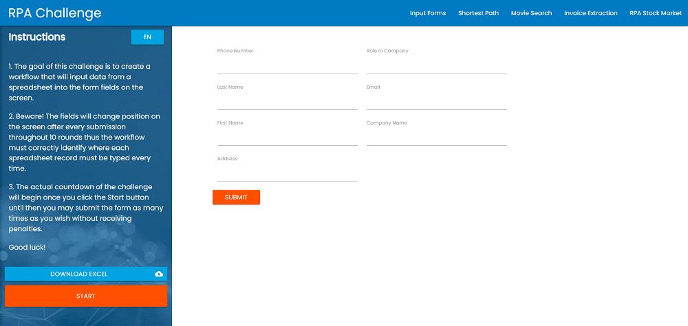

# Automated Form Filling Tool

## [RPA Challenge](https://www.rpachallenge.com/)
The goal of this challenge is to create a workflow that will input data from a spreadsheet into the form fields on the screen.

Beware! The fields will change position on the screen after every submission throughout 10 rounds thus the workflow must correctly identify where each spreadsheet record must be typed every time.

   

   
   

## C# Console Application with Selenium

   
   

## UiPath Robotic Process Automation
